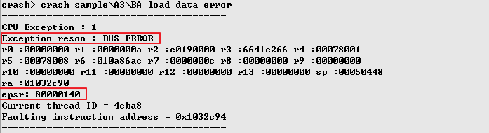
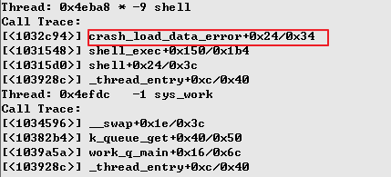
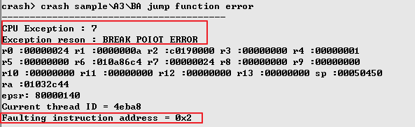
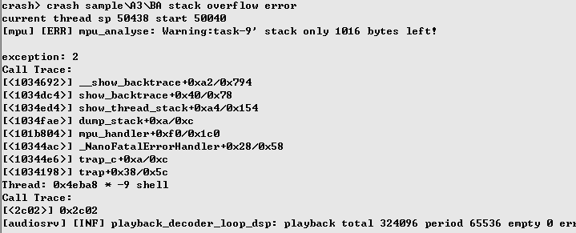

**ZS285A FAQ**

**Released at 1.0.0**

**January 18,2021**


## Disclaimer

Information given in this document is provided just as a reference or example
for the purpose of using Actions ’products, and cannot be treated as a part of
any quotation or contract for sale.Actions products may contain design defects
or errors known as anomalies or errata which may cause the products ’functions
to deviate from published specifications.Designers must not rely on the
instructions of Actions ’products marked “reserved ”or “undefined ”.Actions
reserves these for future definition and shall have no responsibility whatsoever
for conflicts or incompatibilities arising from future changes to them.

ACTIONS DISCLAIMS AND EXCLUDES ANY AND ALL WARRANTIES, INCLUDING WITHOUT
LIMITATION ANY AND ALL EXPRESS OR IMPLIED WARRANTIES OF MERCHANTABILITY,
ACCURACY, SECURITY, FITNESS FOR A PARTICULAR PURPOSE, TITLE, AND AGAINST
INFRINGEMENT OF INTELLECTUAL PROPERTY AND THE LIKE TO THE INFORMATON OF THIS
DOCUMENT AND ACTIONS PRODUCTS.IN NO EVENT SHALL ACTIONS BE LIABLE FOR ANY
DIRECT, INCIDENTAL, INDIRECT, SPECIAL, PUNITIVE, OR CONSEQUENTIAL DAMAGES
WHATSOEVER, INCLUDING, WITHOUT LIMITATION FOR LOST OF DATA, PROFITS, SAVINGS OR
REVENUES OF ANY KIND ARISING FROM USING THE INFORMATON OF THIS DOCUMENT AND
ACTIONS PRODUCTS.REGARDLESS OF THE FORM OF ACTION, WHETHER BASED ON CONTRACT;
TORT; NEGLIGENCE OF ACTIONS OR OTHERS; STRICT LIABILITY; OR OTHERWISE; WHETHER
OR NOT ANY REMEDY OF BUYER IS HELD TO HAVE FAILED OF ITS ESSENTIAL PURPOSE, AND
WHETHER ACTIONS HAS BEEN ADVISED OF THE POSSIBILITY OF SUCH DAMAGES OR NOT.

Actions ’products are not designed, intended, authorized or warranted for use in
any life support or other application where product failure could cause or
contribute to personal injury or severe property damage.Any and all such uses
without prior written approval

## ZS285A FAQ, release 1.0.0

of an Officer of Actions and further testing and/or modification will be fully
at the risk of the customer.

## Ways of obtaining information

Copies of this document and/or other Actions product literature, as well as the
Terms and Conditions of Sale Agreement, may be obtained by visiting Actions
’website at:[http://www.actions-semi.com](http://www.actions-semi.com/)or from
an authorized Actions representative.

## Trademarks

The word "Actions",and the logo and Word "炬芯" are the trademark of Actions
Technology Co., Limited.Names and brands of other companies and their products
that may from time to time descriptively appear in this document are the
trademarks of their respective holders, no affiliation, authorization, or
endorsement by such persons are claimed or implied except as may be expressly
stated therein.

## Rights Reserved

The provision of this document shall not be deemed to grant buyers any right in
and to patent, copyright, trademark, trade secret, know how, and any other
intellectual property of Actions or others.

## Miscellaneous

Information contained or described herein relates only to the Actions products
and as of the release date of this publication, abrogates and supersedes all
previously published data and specifications relating to such products provided
by Actions or by any other person purporting to distribute such
information.Actions reserves the rights to make changes to information described
herein at any time without notice.Please contact your Actions sales
representatives to obtain the latest information before placing your product
order.

## Additional Support

Additional products and company information can be obtained by visiting the
Actions website at:[http://www.actions-semi.com](http://www.actions-semi.com/)

Support: For other information about the company and the products, welcome to
our website:http://www.actions-semi.com

Overview

1.  Document Purpose

    This document is designed to introduce some Frequency asked Questions in a
    the ZS285A scheme development process, facilitate customers to quickly get
    familiar with zs285a scheme development and provide some programming
    guidance

1.  Reference documentation

-   <https://docs.zephyrproject.org/1.9.0/>

1.  Version History

Table 1: Version History

| Date       | Version | Comment         | The author          |
|------------|---------|-----------------|---------------------|
| 2019-03-20 | 1.0     | Initial version | zs285A Project Team |

CHAPTER 3

List of FAQ questions

# What is The Name  Rule of Actions solution

For Actions solutions , they are usually divided in to several parts, Chip set , SDK , Hardware design reference files, PC Tools and kinds of development Tool. The SDK name and the chip set partnumber  are not exactly mapped. For example , in this document ,ZS285A means a solution name. So the SDK name is ATS285X_ZS285A_Firmware_V2.0_20210118. 

ATS285X means a serial partnumber of chips, including ATS2853 , ATS2859... .  That means the files are able to fit these chips.

In ZS285A , Z means that the OS is Zephyr, and A means the first solution.  Also Actions can have US281B(UCOS on ATS281x)

then Firmware means it is a SDK (software develop kit), with necessary public documents.

Then the version and released date.

When a developer need to find a patch or ask for support, the version and date are important.

 Furthermore Actions usually use bug management system (FAQ) and customer requirement management system (CRF) to manage developers bugs and requirements.  For more support , please looking for http://www.actions-semi.com


# The Feature differences between ZS285a and US281B  

1.   Full-scene TWS can be supported in ZS285A . But US281B  do not support TWS mode in several scenes , like (usound, fm).
2.  sniff mode is supported in The 285A . But the 281B does not support it. A TWS  team will lost sniff mode if a 281B device exists in the team.
3.  Hot-plug Event  is not supported when a ZS285A works under TWS sub-device. But it will work in US281B under the same state.
4.  The key Event from TWS sub-device can be responded in every mode after ZS285A TWS team paired. But in can only responded in TWS mode after US281B TWS team paired. For example , local music play application not support TWS play , so the TWS master-device cannot response the key event from TWS sub-device. Also with calling mode , usound mode and FM mode.
5.  USB Audio Card Volume table , it is designed in 16 steps. And under any Host OS like windows or OSX,  the volume adjusted message are mapped into these 16 steps to the ZS285A. But US281B is different.
6.  Volume table on Player is 0 to 15 (step is 1)on ZS285A if it has been configured in 16 volume level. But in US281B, the value in the table is [0,2,4,6...,30]

# Can developers compile the code and package Firmware under windows environment for ZS285A?

The developers can compile ZS285A code with gcc tool chain (Mips-M4K). The GCC tool chain only runs under unix like environments. It is recommended that the compile operation under Ubuntu16.04 X64 in virtual machine and the image with tool chain and package tool can be offered by FAE. Because the other tools like Firmware downloader can be only runs under windows. But you can try to setup the linux shell in windows , like MSYS2 or WSL.

# Why the new adding source code files are not compiled

Under the Zephyr framework, the compiled files are assigned manually by edit the makefile file. 

It can be seen that a file is able to be compiled by this format setting:

```
obj-y += filename.o
```

Let's take a look at Makefile under btmusic application as an example:

./ZS285A/samples/bt_box/src/btmusic

btmusic/
├── btmusic_event.c
├── btmusic_func.c
├── btmusic.h
├── btmusic_main.c
├── btmusic_media.c
├── btmusic_view.c

├── Kconfig
└── Makefile

```
obj-y += btmusic_main.o
obj-y += btmusic_func.o
obj-y += btmusic_event.o
obj-y += btmusic_view.o
obj-y += btmusic_media.o
```

You can also modify the makefile to start a condition compile task by using obj-$(configuration).

# How the header file from a subdirectory can be referenced by other modules

Take main application for example:

I want to ref   /ZS285A/samples/bt_box/src/include/app_defines.h 

in /ZS285A/samples/bt_box/src/main/system_app_main.c

I need to add a new line in /ZS285A/samples/bt_box/src/main/Makefile :

```
subdir-ccflags-y += -I${ZEPHYR_BASE}/samples/bt_box/src/include
```


# How to see if a certain directory is involved in the compilation

The temporary compiled files and the final firmware (*.FW) are not in the source directory. They are in another new directory. The default storage path is ：

ZS285A/samples/bt_box/outdir/
└── ats2853_dvb
    ├── arch
    ├── boards
    ├── drivers
    ├── ext
    ├── _firmware
    ├── firmware.xml
    ├── fw.bin
    ├── include
    ├── isrList.bin
    ├── isr_tables.c
    ├── isr_tables.o
    ├── kernel
    ├── lib
    ├── libapplication.a
    ├── libzephyr.a
    ├── linker.cmd
    ├── linker-pass2.cmd
    ├── Makefile
    ├── misc
    ├── parttbl.bin
    ├── scripts
    ├── sdfs
    ├── src
    ├── subsys
    ├── tests
    ├── zephyr.bin
    ├── zephyr.elf
    ├── zephyr.lnk
    ├── zephyr.lst
    ├── zephyr.map
    ├── zephyr_prebuilt.elf
    ├── zephyr.stat
    └── zephyr.strip

Folder _firmware is designed to storage  Firmware file and other automatically generated head files.

And you can find applications compiled results in 

/ZS285A/samples/bt_box/outdir/ats2853_dvb/src/


# What are the limitations on the use of the printf() function

You can use printf to output in serial port shell, but there are some limitations:

1.  You cannot use float or double in printf().
2.  you cannot use long long variety . So if you use printf(%llx), you can only get a 32bit data.
3.  After the first thread main start, printf() use DMA. And the baurdrate is 3Mbps and the buffer is 1KB as default. So overflow will occur if too much data need to output. you need to take care of this issuse.
4.  before the first thread main start, call printf() will disable interrupt  and use CPU to write FIFO via register directly.

# how to use System timer function

The timing functions provided by the OS are as follows:

```
k_timer_init() \\initializes the timer

k_timer_start() \\starts the timer 

k_timer_stop()  \\Stop Timer
```

This timer uses hardware timer. 

But it is recommended that developers can use software timers as well.  Using soft timer will be more simple. Please take a look at /ZS285A/include/thread_timer.h .

# how to use time stamp functions 

The system provides some of the following time stamp test functions:

1.  ```
    u32_t k_uptime_get_32(void)
    ```

    This function returns time in unit of ms(millisecond). It works by using system tick. For example, the default system tick is about 4ms. So the accurate will be 4ms,  a time interval less than 4ms will be 4ms.

    

2.  ```
    #define k_cycle_get_32()
    ```

    This function returns the current counter cycles of the hardware timer. The hardware timer clock source is from 24MHz. So you can get accurate time (unit is us, Microsecond) by dividing the interval counters by 24.
    And  you can also get an accurate time (unit is ns , Nanosecond) by the following function:

    ```
     SYS_CLOCK_HW_CYCLES_TO_NS()
    ```

    

# What delay functions from the OS

The OS provides the following time-delay functions:

1.  ```
    k_sleep()
    ```

    The function will hibernate the current thread in several system ticks. The cycle of ticks comes from  input parameters in unit of ms, depending on the default tick time setting.

    

2.  ```
    k_busy_wait()
    ```

    This function delays time in unit of us(microsecond).  The wait means CPU is waiting for the time goes by. It will not release CPU to work the other tasks. And another limitation is that this function depends on hardware timer. So the input parameter need to avoid too large. 

3.  ```
    #define MSLEEP(x) OS_TickDelay(x)
    #define UDELAY(x) OS_TickDelay(1)
    ```

# What is message queue in ZS285A?


Because Zephyr not allow send message in the context of interrupt.

So now in ZS285A, developers need to send message to workqueue of OS.

# What is the sequence from power on

The sequence of ZS285A is:

Power on reset -> Boot ROM -> MBR -> OS init -> start main task(application)–\>bt_manager–\>bt service–\> front app

The developers can start to modify the application at :

\ZS285A\samples\bt_box\src\main\system_app_main.c

you can also find the task register here:

```
APP_DEFINE(main, _main_stack, CONFIG_MAIN_STACK_SIZE,\

​      APP_PRIORITY, RESIDENT_APP,\

​      NULL, NULL, NULL,\

​      NULL, NULL);
```


# What message does the main application process

The first app SDK currently runs first is the main app, a resident app that is
neither in the front ground nor in the background. The application completes the
following work:

1.  Process some INPUT messages reported at the bottom, if the hot key message,
    directly in the main application; if the non-hot key message, forward the
    message to the front desk, processed by the front desk

2.  Process the UI messages sent by other modules and transfer the UI
    message to the corresponding TTS event or LED event for the UI display

3.  The processing of application switching, including button
    application switching, entry and exit of lienin hot plug
    application, application entry and exit after linein energy value
    detection, and synchronous creation and exit of Bluetooth in box
    mode

4.  Operation of the system monitor module, including detection of hot
    plug events, whether to enter power saving mode

    You can see here that both input and ui messages need to be
    forwarded or processed by main, and if the main thread is blocked
    for too long, it may cause messages sent by other threads to be
    blocked because they cannot be processed in time.Since the current
    SDK threads share one mailbox,, make sure that messages from main
    threads are processed in time to avoid excessive execution.

# How an application has been created and quit

Developer can send MSG_START_APP to main thread to create an application or MSG_EXIT_APP to quit an application.

for example: 

```
struct app_msg msg = {0};

msg.type = MSG_START_APP;

msg.value = APP_ID_XXX;

send_async_msg(APP_ID_MAIN, &msg);
```

Here APP_ID_MAIN means the main thread will receive the message. And msg.type describes message type. And send_async_msg means sending an asynchronous message. You can find the detail message definition in \ZS285A\ext\actions\include\msg_manager.h .

It is same to quit an application.

And in main, after the thread receive the start or exit message, it will go to different branch , like:

```
case MSG_START_APP:
case MSG_EXIT_APP:
```

For more information , refer to <ZS285A Application Development Guide>

# How the applications switch

The module that manage the switch of the applications is the \ZS285A\ext\actions\component\system\app_switcher.c . 

The function in the code is the app_switch():

```
int app_switch(void *app_name, u32_t switch_mode, bool force_switch)
```

The switch_mode has the following parameters:

```
typedef enum{
  /** next app */
  APP_SWITCH_NEXT = 0x1,
  /** prev app */
  APP_SWITCH_PREV = 0x2,
  /** last app */
  APP_SWITCH_LAST = 0x04,
  /** curret app  */
  APP_SWITCH_CURR = 0x08,
}app_switch_mode_e;
```

If developer switch to the assigned application,  passing the app_name name
is necessary.

Note:

​	The calling function is synchronized. When switcher in main thread decides to switch, it must wait after the current application exit. Then the new application can start and wait the new one entry its message loop. Then the the result returns from switcher.

# How to create or destroy hot plug application 

The hot plug application is not activated by default. When a corresponding hot plug event occurs, main calls app_switch_add_app() or app_switch_remove_app() to add or remove the current application from the link list. Take the linein application as an example, when a message receiving the linein insertion, the main thread handles as follows:

```
  case HOTPLUG_LINEIN:

  \#ifdef CONFIG_LINE_IN_APP

​    if (msg->value == HOTPLUG_IN) {

​      app_switch_add_app(APP_ID_LINEIN);

​      app_switch(APP_ID_LINEIN, APP_SWITCH_NEXT, false);

​    } else if (msg->value == HOTPLUG_OUT) {

​      _system_remove_app(APP_ID_LINEIN);

​    }

  \#endif

​    break;
```


# How to lock application switching 

Take Bluetooth call as an example. If developer hopes to keep in the phone call status , no interruption by any messages  (including hot-plug or key message), the  following functions are useful.

```
app_switch_lock()
app_switch_unlock()
app_switch_force_lock()
app_switch_force_unlock()
```

# How to add a message-processing to an application

All the applications are message-driven. The structure of message is defined as follows:

```
struct app_msg
{
  uint8_t sender;
  uint8_t type;
  uint8_t cmd;
  uint8_t reserve;
  union {
​    char content[MSG_CONTENT_SIZE];
​    int value;
​    void *ptr;
  };
  MSG_CALLBAK callback;
  struct k_sem *sync_sem;
};
```

The message type passed uses the type domain, which has only 8 bit, assignment
rules as follows:

1.  The message type of a non-foreground application is defined in msg_manager.h

2.  The foreground applied message is defined in the header file inside the
    foreground itself.

Take a bluetooth manager insert message sent to the main as an example, the send message example code is as follows:

```
int bt_manager_state_notify(int state)
{
  struct app_msg  msg = {0};
  msg.type = MSG_BT_EVENT;
  msg.cmd = state;
  return send_async_msg("main", &msg);
}
```

# How many types of messages does the foreground application need to handle

The foreground application needs to handle the following categories of messages:

1.  MSG_BT_EVENT: Bluetooth subsystem,  include Bluetooth connection and status switching .

2.  MSG_INPUT_EVENT:  buttons message, for more information , refer<Application Development Guide>
3.  MSG_TTS_EVENT:  to start or stop TTS (voice promotion) messages. 
4.  MSG_xxx_EVENT: applies its own self-defined message.
5.  application exit message.

Since the current UI display module is implemented in message-driven mode, some system UI foreground applications are generally not directly responsible and handled by the main module, applying private UI needs to be implemented in the application.

# How to send message in an interrupt

The current system is not allowed to send messages in an interrupt. How does the
developers do if they want to send messages in the interrupt?

It can be forwarded via a system work to start a work, in the interrupt when
sending a message in work.

# How to configure the Bluetooth name and the MAC address

When SDK does not configure a Bluetooth name and a MAC address, it randomly
generates a MAC address, and the Bluetooth name will have a combination of
\$BT_PRE_NAME_\#MAC, such as what ZS285A_F44EFC00038A. Developers can  modify BT_PRE_NAME  in \ZS285A\samples\bt_box\app_conf\dvb\nvram.prop. And the developers can also define the name of Bluetooth device , BT MAC and BLE Name by enable the followings and disable BT_PRE_NAME

```
#BT_PRE_NAME
BT_NAME=ZS285A_F44EFC00038A
BT_MAC=F44EFC00224A
BT_LE_NAME=ZS285A_F44EFC00038A
```

If the firmware has been burned, developers can modify the Bluetooth name and
address via the ATT tool or the console shell via serial port. The command in console has been defined in ZS285A\samples\bt_box\src\main\system_app_shell.c 

```
static const struct shell_cmd system_commands[] = {

  { "dumpmem", shell_dump_meminfo, "dump mem info" },

  { "set_config", shell_set_config, "set system config " },

  { "set_hosc_cap", shell_set_hosc_cap, "set hosc cap " },

  { NULL, NULL, NULL }

};
```

use "system set_config BT_NAME xxx" to modify bluetooth device name.

and use "system set_config BT_MAC xxxx" to modify bluetooth MAC address.

# How to set Bluetooth visibility and connectivity

Call the function bt_manager_set_connectable() can set visibility or connectivity,
with the function defined as follows:

```
void bt_manager_set_connectable(bool connectable);
```


# How to clear the pairing list on paired box at a same time

The default setting is that the main box button to clear the main box pairing list,
and the secondary box button to clear the secondary box pairing list. If you
want to press button on the main or secondary box to clear the pairing list at the same time. Developers need to finish the function as follows:

```
void bt_manager_clear_list(void)
```

# How to disconnect and resume Bluetooth with phone

The system provides interface can disconnect Bluetooth from the phone

```
#disconnect Bluetooth connection
void bt_manager_halt_phone(void)
#resume Bluetooth connection
void bt_manager_resume_phone(void)
```


# How to disconnect the two devices in TWS connection

The system provides interface can disconnect Bluetooth TWS connection

Currently btmanager does not have this interface and developers can make an interface call btif_br_disconnect_device() to disconnect TWS.

```
btif_br_disconnect_device(BTSRV_DISCONNECT_TWS_MODE)
////////////////////////////////////////////////////////
enum btsrv_disconnect_mode_e {
  /**  Disconnect all device */
  BTSRV_DISCONNECT_ALL_MODE,
  /** Just disconnect all phone */
  BTSRV_DISCONNECT_PHONE_MODE,
  /** Just disconnect tws */
  BTSRV_DISCONNECT_TWS_MODE,
};
```


# How to enter the pairing mode and stop re-connection

Add an application message to the foreground and convert a key message into
the application message, and calling the bt_manager() ,then bt_manager_tws_wait_pair() will go into pairing mode.

```
#ifdef CONFIG_TWS
  case MSG_BT_PLAY_TWS_PAIR:
​    bt_manager_tws_wait_pair();
​    break;
```


# How to disconnect the phone and enter TWS pairing mode

The system provides interface bt_manager_tws_disconnect_and_wait_pair can
disconnect the Bluetooth phone and enter pairing mode.

```
  case MSG_BT_PLAY_DISCONNECT_TWS_PAIR:
​    bt_manager_tws_disconnect_and_wait_pair();
​    break;
```


# How to configure mutil-phone features

Developers can modify the code to enable the feature by

\\ext\\actions\\component\\bt_manager\\bt_manager_config.c

```
u8_t bt_manager_config_connect_phone_num(void)

{
\#ifdef CONFIG_BT_DOUBLE_PHONE
\#ifdef CONFIG_BT_DOUBLE_PHONE_EXT_MODE
  return 3;
\#else
  return 2;  //enable mutil-phone

\#endif

\#else

  return 1;  //disable mutil-phone

\#endif

}
```


# How to configure the HD calling features

The system supports MSBC HD calling function by default, and developers can turn off the HD calling function by configuring 

```
CONFIG_BT_HFP_MSBC=n
```


# How to compile the Bluetooth BQB firmware

SDK has Bluetooth BQB function.

Default setting of the firmware compiled by CONFIG_BT_CONTROLER_BQB=y,  to enter BQB mode by some trigger conditions. 

And the developers can modify configuration to make the system enter BQB mode directly after power on by 

```
BT_TEST_MODE= 1
```

 in\ZS285A\samples\bt_box\app_conf\dvb\nvram.prop

In the case of burning the firmware, the developers can modify 
BT_TEST_MODE =1 via UART shell console and restart into BQB mode.

# How is the processing process of the key-button message like

Take LRADC key as an example, registering a timing function adckey_acts_poll(), in the lradc key drive which will periodically query the value on lradc if the value
satisfies board. The key value defined in board.h registers input_manager to the
callback function key_event_handle, in the drive and returns board. The key message in board.h as parameter to the key_event_handle, physical layer will only send key value and key press or key lift message.

The input manager is located above the physical layer, and its main role is to
encapsulate the underlying events reported by the physical layer. For example,
the physical layer only has the state of basic key down and key up, while the
application layer may require more diverse button events, such as long press,
double-click, three-click, etc. These these are encapsulated in input manager
and send the encapsulated message to the main module, by the main module to
process or forward the button message.

# How is the processing process of the system messages like

The system message is sent by a timer in the system_monitor module to notify the manager Call its implemented functions such as shutdown or low power.

Application in its own loop needs to call system_monitor. The status update function provided by sys_monitor.c is used to constantly inform system_monitor of the status of the current application. 

# How to save and read the user data

The SDK provides the property interface for accessing user data: 

Accessing SPI NOR flash directly 

In the storage media, written as it is saved:

The developers can take reference in ZS285A\ext\actions\include\property_manager.h

After enable property cache , property is written by default in cache, if the
developer wants to cache The content in is brushed to the nor flash and is available via property_flush:

```
int property_flush(const char *name)；
```


# How to generate a rodatafs.The bin data file and burn the data file to external SPI NOR Flash

With the application configuration application conf: dvb as an example. 

1. Setup a file-folder named datafs under samples/bt_box/app_conf/dvb . 
2. Save the data files that need in samples/bt_box/app_conf/dvb/datafs. 
3. the system script will package these data files together to generate rodatafs.bin file. 
4. The default data file size that can be stored should be 0xc0000 bytes. 
5. If the actual data file size exceeds this limit value, it is necessary to modify CONFIG_DISK_NOR_VOLUME_SIZE according to the actual size. Open fw_maker_ext.cfg file under ats350b/scripts/support/actions/prebuilt/woodpecker/common/bin, 
6. and assign extern \_ data \_ file = "rodatafs.bin", 0x0;
7.  The system will package the rodatafs.bin file with the firmware and the data files in the firmware can be burned to the external nor disk through the multimedia production tool.


# Diagnostic system was abnormal

When the system is abnormal or deadlocked for various reasons it is hard to trace. For some complex problems, the error site must also be restored to analyze the cause of the problems. To address this problem, the SDK API add some back trace functions to locating the problem easily.

The common causes of death are as follows:

1.  Unaligned access to the memory address

2.  Jump to an illegal address, such as 0 address access

3.  Write illegal addresses, such as writing an address that doesn't exist, or write to read-only data. This problem triggers a CPU exception for the hardware
4.  Data in the stack is broken
5.  Stack overflow


One of the most common is address non-aligned access, and wild
pointers cause more mpu exceptions.Here following the analysis steps
for the problem.

# Illegal read or write of the memory address

The test function is as follows:

```
static int crash_load_data_error(int argc, char *argv[])
{
uint32_t *ptr0 = (uint32_t *) strtoul("0x78001",
,!NULL, 16);
uint32_t *ptr1 = (uint32_t *) strtoul("0x78008",
,!NULL, 16);
printk("crash sample： load data error\n");
//will trigger abnormal
*ptr0 = *ptr1;
return 0;
}
```


a system exception, printed as follows:




Exception caused by the load illegal data

From print log, the exception is because BUS ERROR. It Indicate a bus access
error. This generally occurs in memory read or write address illegal statements. From the back trace function call relationship, you can locate directly to the problem function:



The back trace after the load illegal data exception

From the backtrace, the band \* indicates the thread where the exception occurs.
And the function that ultimately points to is the crash_load_data_error. If developer want to pinpoint which line of function is wrong, you can enter the following statement into the sample\\bt_box\\outdir\\zs285a_evb directory:

```
addr2line 0x1032c94 -f -e *.elf

The output will be:
crash_load_data_error
zs285a/tests/actions_test//hw_test/zs282a/crash/crash_test.
,!c:47
??
??:0
```

It is exactly one-to-one corresponding to the source code

Note: An exception caused by reading an illegal address or writing an illegal
address is specifically whether BUS ERROR, is an exception caused by reading or
an exception caused by writing, which needs to be confirmed with backtrace
specific code.

# Exception caused by jumping to an illegal address

The test function is as follows:

```
static int crash_jump_function_error(int argc, char
,!*argv[])
{
void (*jump_func)(void) = (void
,!(*)(void))0x00000000;
printk("crash sample： jump function error\n");
//exception will be
jump_func();
return 0;
}
```

Performing this function triggers a system exception, printed as follows:



Exception caused by the jump to the illegal address

Since jumping to an illegal address, the memory of the illegal address may be an
illegal instruction, or an exception instruction that CPU thinks, like here 0x2 is a break point instruction, which is not currently handling the exception, and thus displays an break point exception.

From backtrace, band \* indicates the thread where an exception occurs and the
ultimate function is crash_jump_function_error

```
Thread: 0x4eba8 * -9 shell
Call Trace:
[<1032c44>] crash_jump_function_error+0xc/0x14
[<1031548>] shell_exec+0x150/0x1b4
[<10315d0>] shell+0x24/0x3c
[<103928c>] _thread_entry+0xc/0x40
```

You can also use the addr2line command above to determine which line of the
function belongs to to more accurately locate the problem

# Exception caused by an illegal address was written

The test function is as follows:

```
static int crash_cpu_mpu_error(int argc, char *argv[])
{
volatile uint32_t *ptr = (uint32_t *) 0x00000;
printk("crash sample： mpu error\n");
//trigger CPU 0 address
*ptr = 0;
//CPU will delay several cycles
delay(10);
return 0;
}
```

An exception is triggered after executing this function, and the exception
prints as follows:

```
[mpu] [ERR] mpu_analyse: <BUG> cpu write addr 0x0
----------------------------------------

CPU Exception : 2
Exception reson : ADDRESS ERROR
r0 :0000001a r1 :0000000a r2 :00000000 r3 :00000008 r4
,!:00000001
r5 :000488f0 r6 :010a86dc r7 :0000003c r8 :00000000 r9
,!:00000000
r10 :00000000 r11 :00000000 r12 :00000000 r13 :00000000 sp
,!:00050450
ra :01032cfc
epsr: 80000141
Current thread ID = 4eba8
Faulting instruction address = 0x1032d04
```

If the print appears [mpu] [ERR] mpu_analyse: \<BUG\> indicates that a mpu
hardware error was triggered.This represents the error to write the data to the
cpu 0 address.The corresponding error function can be found from the backtrace:

```
Thread: 0x4eba8 * -9 shell
Call Trace:
[<1032d04>] crash_cpu_mpu_error+0x10/0x20
[<1031548>] shell_exec+0x150/0x1b4
[<10315d0>] shell+0x24/0x3c
[<103928c>] _thread_entry+0xc/0x40
```


# Stack usage exceeds  limitation

The test function is as follows:

```
static int crash_thread_stackerror_mpu_error(int argc,
,!char *argv[])
{
uint32_t *stack_start;
struct k_thread *thread = k_current_get();
stack_start = (uint32_t *)thread->stack_info.start;
printk("crash sample： stack overflow error\n");
//exceeds on stack bottom
memset(stack_start, 0, 32);
delay(10);
return 0;
}
```

Here you write a few bytes of data to the bottom of the stack to simulate how
the stack is running out. This scenario triggers the following printing:

Stack fast overflow of the print

Since the stack is not really run out at this time, I just give a warning print,
suggesting that the stack is not fast enough. At this time, you generally need
to size the stack and set the stack bigger.

# Stack overflow

The test function is as follows:

```
static int crash_thread_stackoverflow_mpu_error(int argc,
char *argv[])
{
uint8_t static_data[2048];
memset(static_data, 0, sizeof(static_data));
return 0;
}
```

Here excessive local variables are used in the simulation thread, and the
exception printing triggered in this case is as follows:

```
crash> current thread sp 4fc3c start 50040
[mpu] [ERR] mpu_analyse: <BUG>:task-9' stack overflow 1028

bytes!
----------------------------------------

CPU Exception : 2
Exception reson : ADDRESS ERROR
r0 :0004fc50 r1 :00000000 r2 :00000800 r3 :00000000 r4
:00050044
r5 :0004fc50 r6 :0000040c r7 :00000003 r8 :00000000 r9
:00000000
r10 :00000000 r11 :00000000 r12 :00000000 r13 :00000000 sp
:0004fc3c
ra :010340f2
epsr: 80000141
Current thread ID = 4eba8
Faulting instruction address = 0x2c02
```

Here indicates that the thread with priority-9 has a stack overflow, the stack
starting address is 0x50040, but now has used 0x4fc3c

